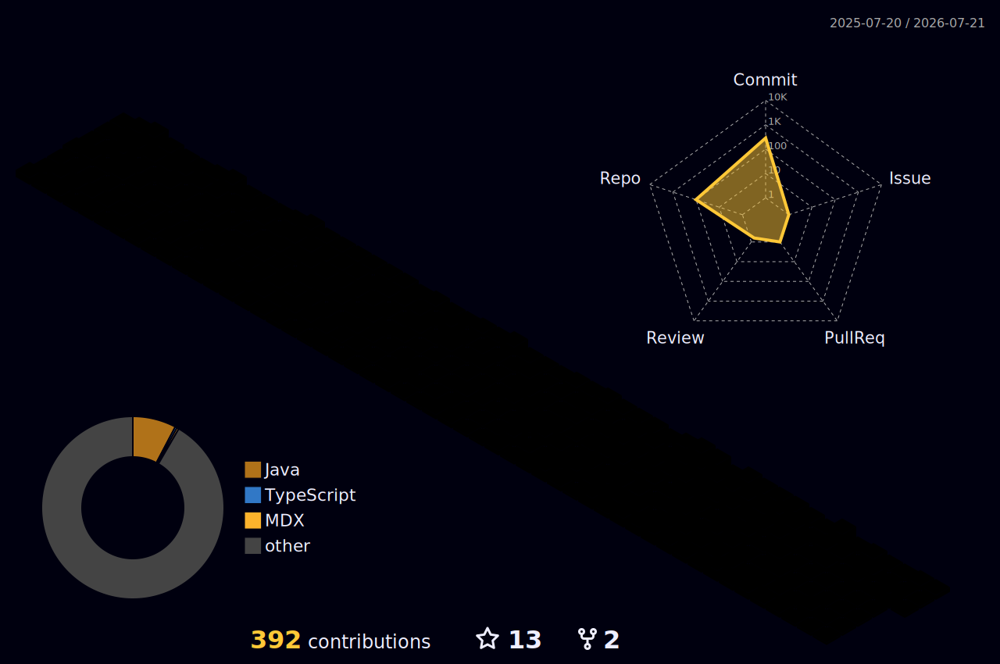

<h1 align="center">𝐇𝐞𝐥𝐥𝐨, 𝐟𝐞𝐥𝐥𝐨𝐰 <𝚌𝚘𝚍𝚎𝚛𝚜></𝚌𝚘𝚍𝚎𝚛𝚜>!  

 
<picture>
  <source media="(prefers-color-scheme: dark)" srcset="https://raw.githubusercontent.com/XingJi-love/XingJi-love//output/github-contribution-grid-snake-dark.svg">
  <source media="(prefers-color-scheme: light)" srcset="https://raw.githubusercontent.com/XingJi-love/XingJi-love/output/github-contribution-grid-snake.svg">
  
</picture>

  

## 📲 网站运营

| Icon         | Name             | Link                                               |
|--------------|------------------|----------------------------------------------------|
| 📊 Statistics| 访客统计         | [https://umami.xingji.fun/](https://umami.xingji.fun/) |

## 🚀 我的github活动 
---

  

<!---->

