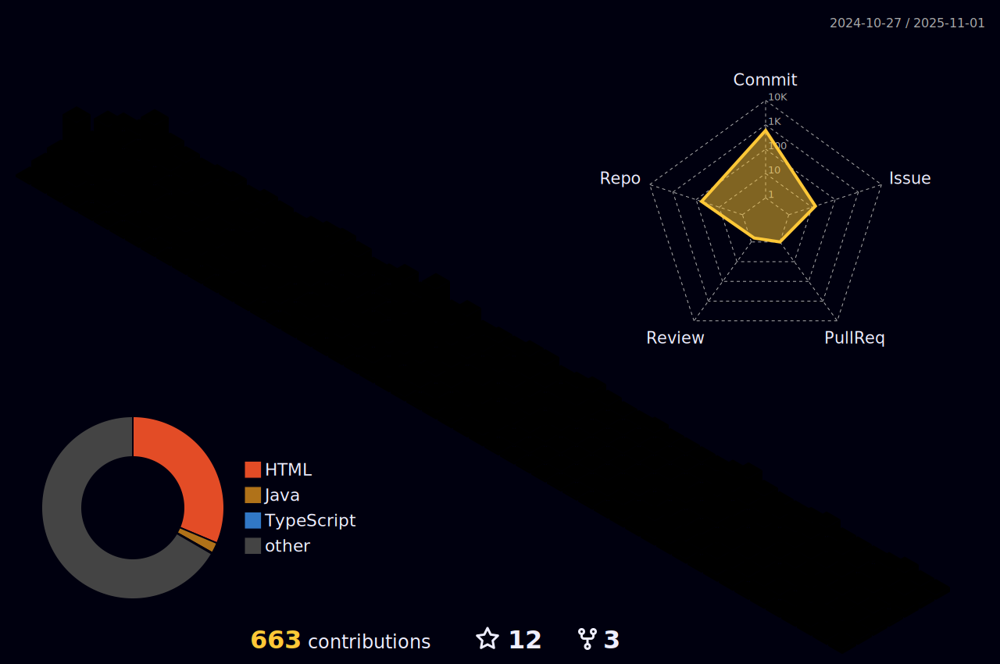

[](https://home.xingji.fun/)

<p align="center">

</p>

<p align="center">

</p>

<h1 align="center">𝐇𝐞𝐥𝐥𝐨, 𝐟𝐞𝐥𝐥𝐨𝐰 <𝚌𝚘𝚍𝚎𝚛𝚜></𝚌𝚘𝚍𝚎𝚛𝚜>! <br>
 
<picture>
  <source media="(prefers-color-scheme: dark)" srcset="https://raw.githubusercontent.com/XingJi-love/XingJi-love//output/github-contribution-grid-snake-dark.svg">
  <source media="(prefers-color-scheme: light)" srcset="https://raw.githubusercontent.com/XingJi-love/XingJi-love/output/github-contribution-grid-snake.svg">
  
</picture>


[](https://home.xingji.fun)

<p align="center"></p>
<p align="center"></p>

<p align="center">
  <a href="https://skillicons.dev">
    
  </a>
</p>

## 📋 Tech Stack

[](https://skillicons.dev)

## 🔨 Tools

[](https://skillicons.dev)

## 📲 网站运营

| Icon         | Name             | Link                                               |
|--------------|------------------|----------------------------------------------------|
| 🏠 Home      | 个人主页         | [https://home.xingji.fun/](https://home.xingji.fun/)  |
| 🪄 Blog      | 个人博客         | [https://love.xingji.fun/](https://love.xingji.fun/) |
| 🪄 Blog      | 个人博客         | [https://blog.xingji.fun/](https://blog.xingji.fun/) |
| 🪄 Blog      | 个人博客         | [https://vite.xingji.fun/](https://vite.xingji.fun/) |
| 🪄 Blog      | 个人博客         | [https://vue.xingji.fun/](https://vue.xingji.fun/) |
| 📊 Statistics| 访客统计         | [https://umami.xingji.fun/](https://umami.xingji.fun/) |
| 🖼️ Image Bed | 自建图床         | [https://pix.xingjilove.us.kg/](https://pix.xingjilove.us.kg/) |  
| 🖼️ Image Bed | 自建图床         | [https://img.xingjilove.us.kg/](https://img.xingjilove.us.kg/) |  
| 🎨 Design    | 封面设计         | [https://cover.xingji.fun/](https://cover.xingji.fun/) |
| 🖥️ Detection | 站点检测         | [https://status.xingji.fun/](https://status.xingji.fun/) |
| 🤖 GPT       | 自建GPT          | [https://chat.xingji.fun/](https://chat.xingji.fun/) |
| ☁️ Tencent   | 腾讯开发者       | [https://cloud.tencent.com/](https://cloud.tencent.com/) |

📕 &nbsp;**Latest Blog Posts**
<!-- BLOG-POST-LIST:START -->
- [第三章：学习建议](https://vite.xingji.fun/CS/学习建议.html)
- [第二章：软件行业中的各种职业方向](https://vite.xingji.fun/CS/软件行业中的各种职业方向.html)
- [第一章：软件设计架构](https://vite.xingji.fun/CS/软件设计架构.html)
- [软考中级 | 软件设计师](https://vite.xingji.fun/Exam/SDE/软考中级-软件设计师.html)
- [Git | 学习笔记（待更新）](https://vite.xingji.fun/Notes/Git/Git-学习笔记.html)
<!-- BLOG-POST-LIST:END -->

                         

                            

[](https://github.com/anuraghazra/github-readme-stats)

<!--START_SECTION:waka-->


**🐱 My GitHub Data** 

> 📦 ? Used in GitHub's Storage 
 > 
> 🚫 Not Opted to Hire
 > 
> 📜 38 Public Repositories 
 > 
> 🔑 0 Private Repositories 
 > 
**I'm an Early 🐤** 

```text
🌞 Morning                31 commits          ██░░░░░░░░░░░░░░░░░░░░░░░   07.16 % 
🌆 Daytime                201 commits         ████████████░░░░░░░░░░░░░   46.42 % 
🌃 Evening                148 commits         █████████░░░░░░░░░░░░░░░░   34.18 % 
🌙 Night                  53 commits          ███░░░░░░░░░░░░░░░░░░░░░░   12.24 % 
```
📅 **I'm Most Productive on Thursday** 

```text
Monday                   54 commits          ███░░░░░░░░░░░░░░░░░░░░░░   12.47 % 
Tuesday                  71 commits          ████░░░░░░░░░░░░░░░░░░░░░   16.40 % 
Wednesday                79 commits          █████░░░░░░░░░░░░░░░░░░░░   18.24 % 
Thursday                 98 commits          ██████░░░░░░░░░░░░░░░░░░░   22.63 % 
Friday                   46 commits          ███░░░░░░░░░░░░░░░░░░░░░░   10.62 % 
Saturday                 41 commits          ██░░░░░░░░░░░░░░░░░░░░░░░   09.47 % 
Sunday                   44 commits          ███░░░░░░░░░░░░░░░░░░░░░░   10.16 % 
```


📊 **This Week I Spent My Time On** 

```text
🕑︎ Time Zone: Asia/Shanghai

💬 Programming Languages: 
Markdown                 3 hrs 15 mins       ████████████████████████░   97.27 % 
TypeScript               2 mins              ░░░░░░░░░░░░░░░░░░░░░░░░░   01.41 % 
CSS                      2 mins              ░░░░░░░░░░░░░░░░░░░░░░░░░   01.32 % 

🔥 Editors: 
VS Code                  3 hrs 21 mins       █████████████████████████   100.00 % 

🐱‍💻 Projects: 
Blog-vitepress-theme     3 hrs 21 mins       █████████████████████████   100.00 % 

💻 Operating System: 
Windows                  3 hrs 21 mins       █████████████████████████   100.00 % 
```

**I Mostly Code in JavaScript** 

```text
JavaScript               4 repos             ███████░░░░░░░░░░░░░░░░░░   26.67 % 
HTML                     4 repos             ███████░░░░░░░░░░░░░░░░░░   26.67 % 
TypeScript               2 repos             ███░░░░░░░░░░░░░░░░░░░░░░   13.33 % 
Java                     1 repo              ██░░░░░░░░░░░░░░░░░░░░░░░   06.67 % 
Markdown                 1 repo              ██░░░░░░░░░░░░░░░░░░░░░░░   06.67 % 
```


**Timeline**


 Last Updated on 12/03/2025 18:46:41 UTC
<!--END_SECTION:waka-->

## 🚀 我的github活动 
---
<p align="center">
  <a href="https://love.xingji.fun">
    
  </a>
</p>




<p align="center">

</p>
